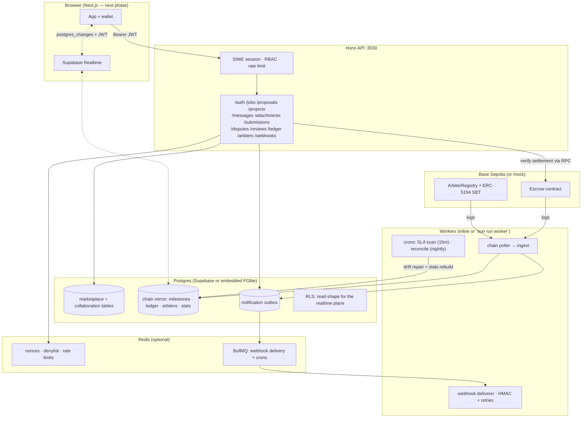

# EscrowLance — Backend

Milestone-based freelance marketplace backend with smart-contract escrow, dispute resolution, and on-chain trust. **Backend-first implementation of the EscrowLance PRD**: every off-chain feature (marketplace, chat, files, submissions, disputes, reviews, notifications, ledger) is built and demoable *before* the Solidity and frontend phases — the chain is behind an adapter seam.

**Stack:** Hono (API) · Postgres via Drizzle (Supabase-compatible; embedded PGlite for zero-infra dev) · Redis via BullMQ (optional; in-process fallback) · viem (Base Sepolia) · SIWE auth · TypeScript throughout.

> **Contracts are live:** [`../../contracts/`](../../contracts/) holds the Foundry implementation (Escrow + ERC-5194 ArbiterRegistry, 90 tests incl. invariant fuzzing). `bun run e2e:anvil` below proves the whole stack against a real EVM.

```
bun install
bun run db:setup        # migrate + seed demo data (embedded Postgres, no infra)
bun run dev             # API + inline workers on :3030
bun scripts/smoke.ts    # full golden-path E2E against the running API (mock chain)
bun run e2e:anvil       # SAME golden path on a real EVM: anvil + deployed contracts
```

That's the entire local setup — no Docker, no Supabase project, no RPC key needed. Every infrastructure dependency has a dev-mode adapter (see [The adapter matrix](#the-adapter-matrix)); flip env vars to go real.

---

## Architecture



### The state split (PRD §7.3, enforced in code)

- **On-chain = money + commitments + trust facts.** Escrow balances, milestone state machine, dispute outcomes, arbiter registry, SBT trust scores, fees.
- **Off-chain = content + velocity.** Job posts, proposals, profiles, chat, files, submission notes, review bodies.
- **The rule:** anything that decides where money goes is authoritative on-chain. The Postgres mirror of chain state (`project_milestones.chain_status`, `ledger_events`, `arbiters`, derived user stats) is an **untrusted cache** built by the indexer. Money-relevant reads re-derive truth from the chain — e.g. `POST /milestones/:id/reviews` checks the mirror *and* the adapter RPC before accepting a review. A nightly reconciliation job re-derives everything and loudly reports drift.

### Load-bearing decisions (considered / rejected)

1. **One indexer pipeline, two event sources.** Real mode polls `getLogs` behind N confirmations; mock mode synthesizes the identical event surface on `/dev/chain/*`. The frontend is built against the real API shape and simply swaps wallet txs in when contracts deploy. *Rejected:* stubbing chain behavior inside route handlers — it would let indexer bugs hide until the "real" integration, which is exactly when you don't want to find them.
2. **SIWE → server-minted Supabase-compatible JWT.** One HS256 token (signed with `SUPABASE_JWT_SECRET`, `sub` = user uuid, `role: authenticated`) authenticates against both the Hono API (Bearer) and Supabase Realtime/Storage. *Rejected:* separate session systems for API vs realtime — double auth surface, drift-prone.
3. **Wei as `numeric(78,0)`, API speaks decimal ETH.** uint256-range values overflow PG `bigint`; the API accepts `"0.05"` and stores exact wei, returning both forms. *Rejected:* floats anywhere near money.
4. **Transactional outbox for notifications.** Events + delivery rows commit with the state change; enqueue happens after commit. A crash between the two loses nothing — the row is still there for the next pass. *Rejected:* fire-and-forget webhooks.
5. **Idempotent ingest keyed on `(tx_hash, log_index)`.** Re-indexing is always safe — duplicates are counted and skipped, stats can never double-count. Illegal state transitions are *recorded* (chain is truth) but *not applied* to mirrors — that's drift, surfaced by reconciliation, never silently patched.
6. **Milestone `ref` travels in the funding tx.** The funding event carries the off-chain milestone UUID as `bytes32`, so the indexer maps on-chain ids to rows deterministically. *Rejected:* matching on `(client, freelancer, amount)` tuples — ambiguous the moment two milestones share an amount.

### The adapter matrix

| Concern | Dev default (zero infra) | Real deployment |
|---|---|---|
| Database | Embedded Postgres (PGlite, file-backed in `./data`) | Supabase Postgres via `DATABASE_URL` |
| Cache/queues | In-process KV + inline workers (single process) | Redis + BullMQ (`bun run worker` for a dedicated worker process) |
| Chain | Mock adapter (`/dev/chain/*` drives the real indexer) | Base Sepolia via viem (`CHAIN_MODE=real` + contract addresses) |
| File storage | Local disk + HMAC-signed URLs | Supabase Storage signed URLs |
| Realtime | Polling the REST API | Supabase Realtime `postgres_changes` (same JWT) |

### Security posture

- `requireAuth` / participant checks on every non-public route; `requireAdmin` for operator levers (each documented with *why* it's admin-gated).
- Rate limiting (fixed-window via KV) on auth (20/min/IP), writes (120/min/user), reads (600/min/user).
- Webhooks signed `X-EscrowLance-Signature: sha256=<hmac>`; consumers verify with the per-subscription secret.
- RLS (`db/rls.sql`) constrains **direct reads** through the Supabase plane (messages/attachments/disputes are participant-only); **all writes go through this API** with privileged credentials. Messages are append-only — no UPDATE/DELETE policy exists, by design (evidence integrity, PRD F6).
- Known MVP simplifications (documented, not hidden): no EIP-1271 contract-wallet login; mock chain endpoints are dev-only (never mounted when `NODE_ENV=production` or `CHAIN_MODE≠mock`); PGlite is single-connection (fine for demo scale — that's why it's the *dev* driver).

---

## API surface

Envelope: `{ "data": ... }` on success, `{ "error": { "code", "message", "details? } }` on failure.

| Group | Endpoints |
|---|---|
| Meta | `GET /health` · `GET /ready` · `GET /overview` (public status/counts/ledger) |
| Auth | `POST /auth/nonce` → `POST /auth/verify` (SIWE) → `GET /auth/me` · `POST /auth/logout` |
| Users | `PATCH /users/me` · `GET /users/:address` · `GET /users/:address/reviews` |
| Jobs (F1) | `GET /jobs` (filter `status/category/skill/q`) · `POST /jobs` · `GET /jobs/:id` · `PATCH /jobs/:id` (poster, while open) · `POST /jobs/:id/cancel` |
| Proposals (F2) | `POST /jobs/:jobId/proposals` (one per freelancer) · `GET /jobs/:jobId/proposals` · `PATCH /proposals/:id/withdraw` · `POST /proposals/:id/accept` → **creates the project** |
| Projects | `GET /projects` · `GET /projects/:id` (milestones incl. fund tx hints) · `GET /projects/:id/milestones` · `GET /projects/:id/reviews` |
| Chat (F6) | `GET /projects/:id/messages` (cursor) · `POST /projects/:id/messages` |
| Files (F7) | `POST /projects/:id/attachments` (init → upload URL) · `POST /attachments/:id/confirm` · `GET /attachments/:id/url` · `PUT/GET /attachments/:id/raw` (local driver) |
| Submissions (F8) | `POST /projects/:id/milestones/:mid/submissions` · `POST .../request-changes` (soft state) · `GET .../submissions` |
| Disputes (F10) | `POST /projects/:id/milestones/:mid/disputes` · `GET /disputes` · `POST /disputes/:id/arbiter-proposal` · `POST /admin/disputes/:id/assign-arbiter` (after 48h) |
| Reviews | `POST /milestones/:id/reviews` (settlement-verified, stores tx hash) · `GET /milestones/:id/reviews` |
| Ledger (F13) | `GET /ledger` · `GET /ledger/summary` (incl. accrued fees) |
| Arbiters (F11/F12) | `GET /arbiters` · `GET /arbiters/:address` (SBT trust score) |
| Webhooks (F9) | `GET/POST /webhooks` · `DELETE /webhooks/:id` · `GET /webhooks/:id/deliveries` |
| Admin | `GET /admin/overview` · `POST /admin/reconcile` · `GET /admin/reconciliations` · `POST /admin/indexer/reset` |
| Dev chain* | `GET /dev/chain/state` · `POST /dev/chain/{fund,submit,approve,cancel,dispute,resolve,register-arbiter,deregister-arbiter,withdraw-fees}` |

\* mounted only when `CHAIN_MODE=mock && NODE_ENV≠production`.

`requests.http` walks the entire golden path with copy-paste-able calls.

## Demo wallets (seeded)

| Role | Address | Key |
|---|---|---|
| Client (Maya) | `0xf39fd6e51aad88f6f4ce6ab8827279cfffb92266` | `0xac09…ff80` |
| Freelancer (Ravi) | `0x70997970c51812dc3a010c7d01b50e0d17dc79c8` | `0x59c6…690d` |
| Arbiter (Ines) | `0x9965507d1a55bcc2695c58ba16fb37d819b0a4dc` | `0x8b3a…ffba` |
| Admin | `0x8d2cc5f9114234f2af1893997410dd9edd7a1f37` | `0x92db…0e6` |

The seed creates the cast, a 2-milestone job, an awarded project with chat, and runs milestone 1 through fund → submit → approve (ledger + stats + fee populated). Milestone 2 is funded and dispute-ready for the live demo.

## Commands

```
bun run dev          # API + inline workers (hot reload)
bun run worker       # dedicated worker process (Redis/BullMQ mode)
bun run db:generate  # regenerate SQL migrations from src/db/schema.ts
bun run db:migrate   # apply migrations + RLS + realtime publication
bun run db:seed      # reset + seed demo state
bun run test         # vitest (31 tests: domain, SIWE, webhooks, indexer integration)
bun run typecheck    # tsc --noEmit
bun scripts/smoke.ts # E2E golden path against a running server
```

## Real deployment (Supabase + Redis + Base Sepolia)

1. `docker compose up -d` (Postgres + Redis) or point at a Supabase project.
2. Copy `.env.example` → `.env`, set `DATABASE_URL`, `REDIS_URL`, `SUPABASE_URL`, `SUPABASE_SERVICE_ROLE_KEY`, `SUPABASE_JWT_SECRET`.
3. Create the storage bucket named by `STORAGE_BUCKET` (service-role only — all object access flows through the API).
4. Deploy the contracts (`cd ../../contracts && forge script script/Deploy.s.sol --rpc-url $BASE_SEPOLIA_RPC_URL --broadcast`), then set `CHAIN_MODE=real`, `ESCROW_ADDRESS`, `ARBITER_REGISTRY_ADDRESS`. The indexer polls both addresses (escrow milestones/fees + registry trust events) and normalizes viem's BigInt args into the canonical event shape.
5. `bun run db:migrate && bun run db:seed` (or your own data) → `bun run start` + `bun run worker` behind a process manager.

The nightly reconciliation additionally checks the **solvency invariant** server-side (on-chain escrow balance vs Σ unsettled milestones + accrued fees, from the ledger) and reports it in every run's JSON report.

## Testing

- **Domain unit tests** — the milestone state machine (legal transitions, review unlock vs. client-cancel, stats predicates), money math (wei ⇄ ETH round-trips beyond safe-integer range, floor-fee semantics), uuid↔bytes32 refs (incl. the leading-zero regression the smoke test caught).
- **SIWE tests** — real EIP-4361 messages signed by real keys: tamper, replay (single-use nonce), wrong domain/chain, expiry, stale issued-at.
- **Webhook domain tests** — HMAC determinism/tamper detection, exponential retry ladder with cap, 2xx-only success.
- **Indexer integration test** — the real pipeline against embedded Postgres: happy path, dispute → split resolution (+ trust score), idempotent re-ingest, illegal-transition drift handling, project completion, outbox fan-out.

## What's next (build plan phase 3+)

1. ~~Foundry contracts~~ **DONE** — [`../../contracts/`](../../contracts/): Escrow + ArbiterRegistry, 90 tests, invariant fuzzing (solvency, conservation, no-double-settle), event surface locked to `src/chain/abi.ts`, proven end-to-end on anvil (`bun run e2e:anvil`) and ready for Base Sepolia.
2. **Next.js frontend** — RainbowKit + wagmi, SIWE login against this API, Supabase Realtime for chat/ledger, fund/submit/approve/dispute wallet txs replacing the `/dev/chain` calls (the e2e-anvil script is the reference implementation of those interactions).
3. Pull from the upgrade roadmap: ERC-4337 paymaster (fixes the recruiter-without-testnet-ETH demo problem), EAS-attested reviews, deadlines/auto-release, ERC-20 support (the contract storage layout already reserves room).
